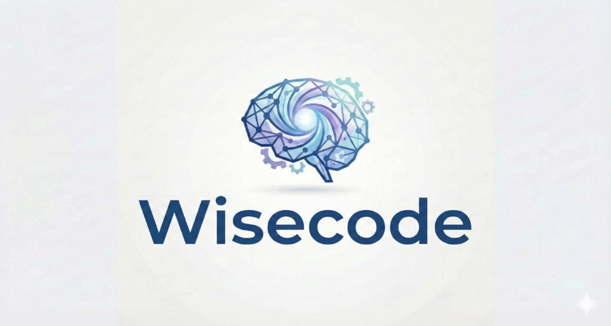

# Wisecode AI: Compliance & Security

Enterprise-grade AI security agent for automated code compliance, auditing, and self-healing.

## Features

- **Automated Compliance Checks**: GDPR, HIPAA, PCI-DSS.
- **Security Audits**: Detects hardcoded secrets, injection vulnerabilities.
- **Quick Fixes**: AI-powered code remediation for Python, Java, Go, JS, TS, C, C++.
- **Project Guide**: Step-by-step implementation plans.
- **Deep Explanations**: Understand *why* code is non-compliant.

## Usage

1. Open a code file.
2. Click "Full Scan" in the dashboard.
3. Review violations and click "Auto-Fix".

## Configuration

1. Go to **File -> Preferences -> Settings** (or split `Ctrl+,`).
2. Search for "Wisecode".
3. Enter your **IBM Cloud API Key** and **Project ID**.
4. (Optional) Select your region (default: `us-south`).

Alternatively, you can use a `.env` file in the extension root, but Settings are recommended.

## License

MIT
